# Getting Started with React App Component testing with Cypress

## Introduction

React application is made up of components and the react framework comes bundled with testing library @testing-library/react. The react testing library utilizes JEST to run the tests and the tests runs by creating Virtual DOM and we will not know the look and feel of the component without starting the full application.

If we know how our component looks at the early development stage and imagine how beneficial it will be to load the component in real browser which gives feedback during development stage itself and we can then write tests for these components, which includes functional as well as visual.

### Getting Started

For this example i have created a simple react app which flips the card upon clicking of a button, which will look like below upon start

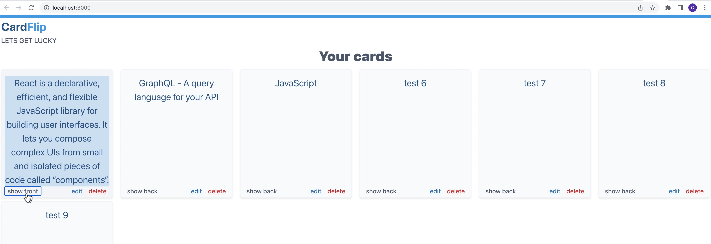

### Folder structure

Below is our folder structure

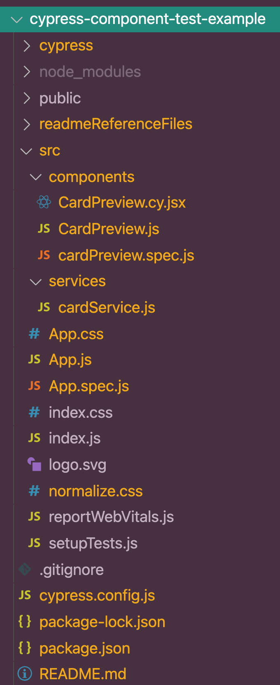

We have a single component called CardPreview

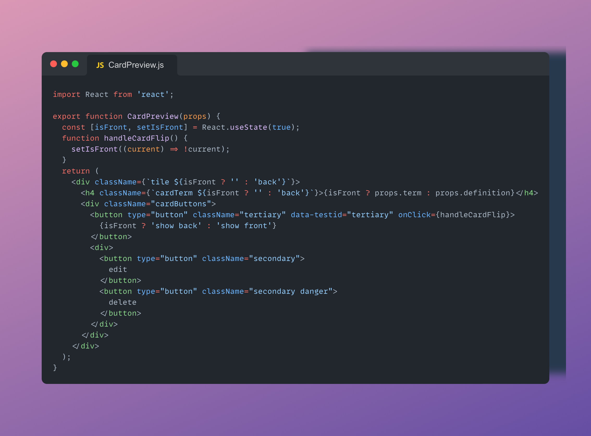

### Writing Jest test with @testing-library/react

By looking into our component, we can see that CardPreview component accepts props which should contain term and definition

@testing-library/react provides render function which accepts the Component to create Virtual DOM and returns functions using which we can query for the elements like below

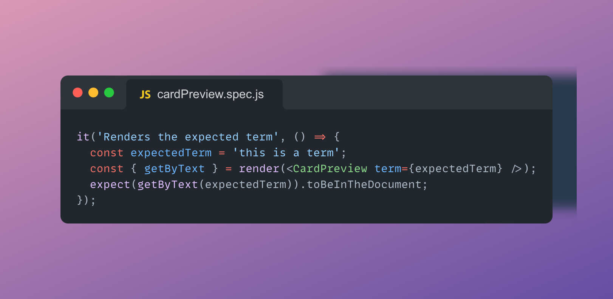

In the above test we are validating if the component loads the term we passed.

Let's see how we can trigger button click events

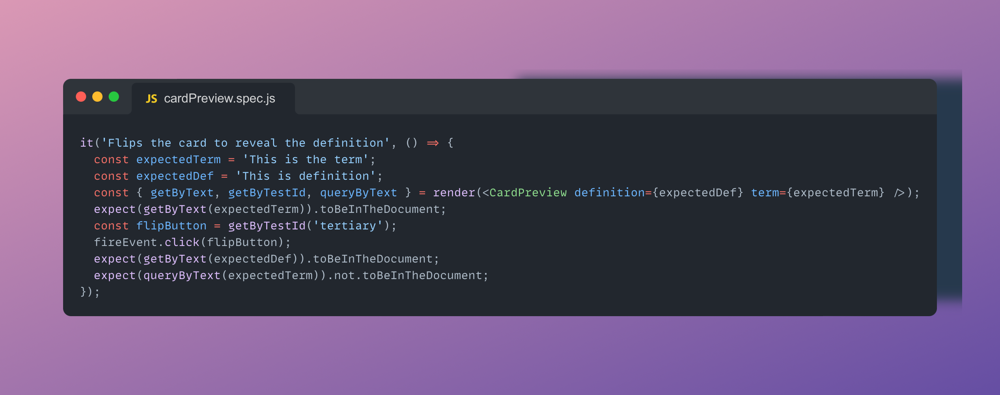

In the above test we have used fireEvent from @testing-library/react to trigger button click event and we are validating whether the flipping card changes the text from term to definition

#### Running the Jest Tests

`npm test`

Running npm test command will execute all the Jest tests and the output in the terminal would look like below

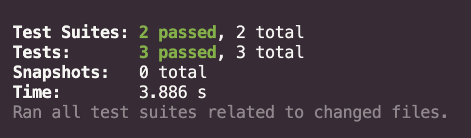

## Writing Component testing with Cypress

With cypress we can load our component in real browser and write tests the way we write end to end tests.

**pre-requisites**

1. Install cypress by executing command **npm install cypress**
2. Open cypress by executing command **npx cypress open**
3. Select the Component Testing as testing type

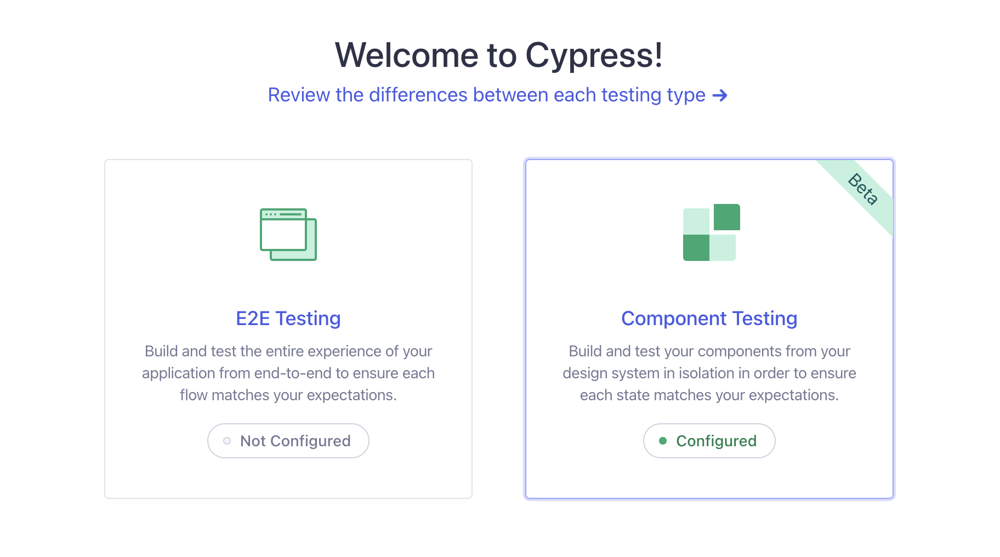

4. Cypress auto detects the framework and we can simply click on Next step for configuration

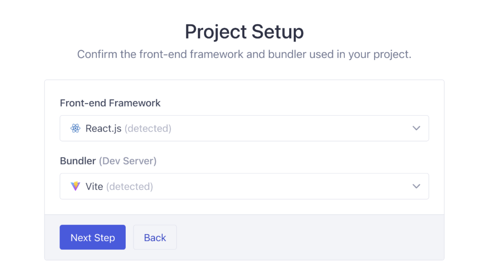

5. Cypress will create all the required config files along with an example component test for us

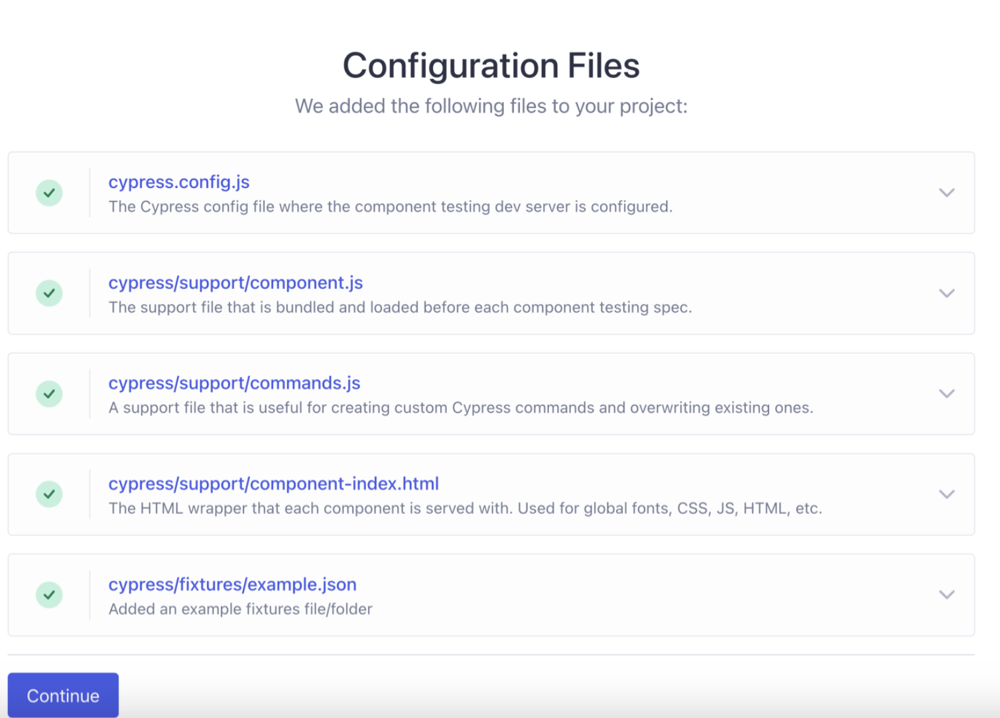

**Note: In this repository i have configured everything needed.**

### Writing our first component test using cypress

Under our src > components let's create a new file called CardPreview.cy.js

In Jest with @testing-library/react we used render function to render the component to Virtual DOM, but with Cypress we are going to use mount function to mount the Component to real browser and render it.

Our test will look like below

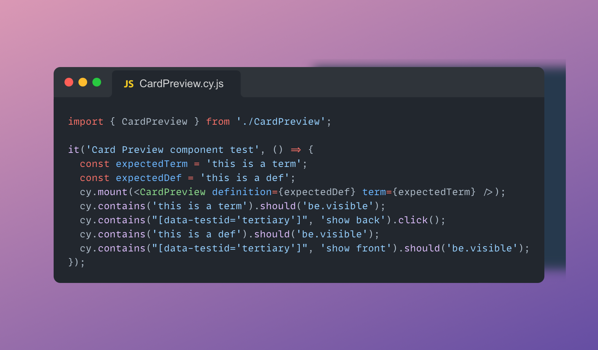

As we can see, once we mount the component, our cypress commands just looks like how we use it in end to end testing.

In the above cypress component test we are checking

1. cy.contains('this is a term').should('be.visible') - This command ensures the text is visible in the browser
2. cy.contains("[data-testid='tertiary']", 'show back').click() - This command finds the element based on text and custom test id attribute and then clicks(In Jest we used fireEvent from react testing library)
3. cy.contains('this is a def').should('be.visible') - This command validated if the text is changed to what we expect after flipping the card from step 2
4. cy.contains("[data-testid='tertiary']", 'show front').should('be.visible') - This command validates if the button text changed after flip.

### Running our Cypress component test

`npx cypress open --component`

Executing the above command directlry open the Component testing browser selection window

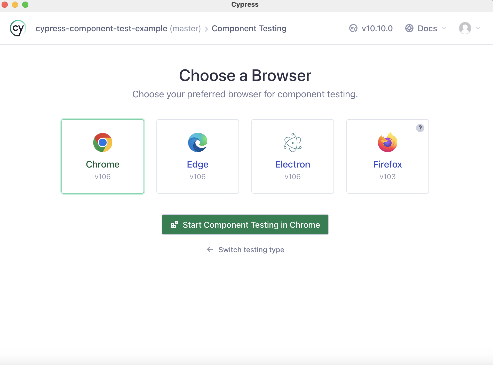

Once we select the browser and click on Start Component Testing in Chrom, our spec selection window displays, listing all of the component tests.

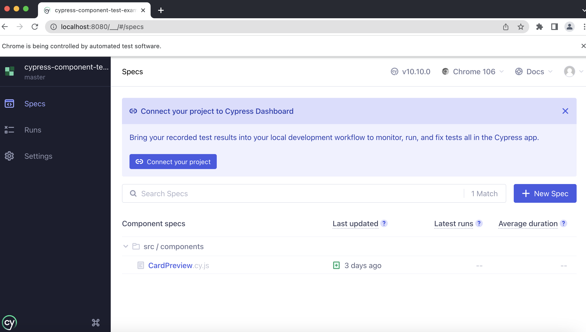

We can click on our component test and see the action

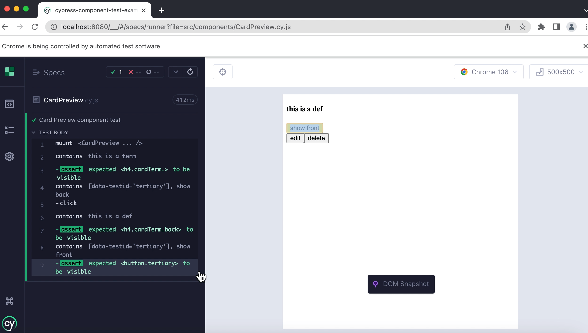

Great, our component test is working fine and we can see the test running and component mounted in the real browser. But our CSS is not loaded!

In order for CSS to be loading while we mount our component test, we need to import the CSS in cypress/support/component.js file like below

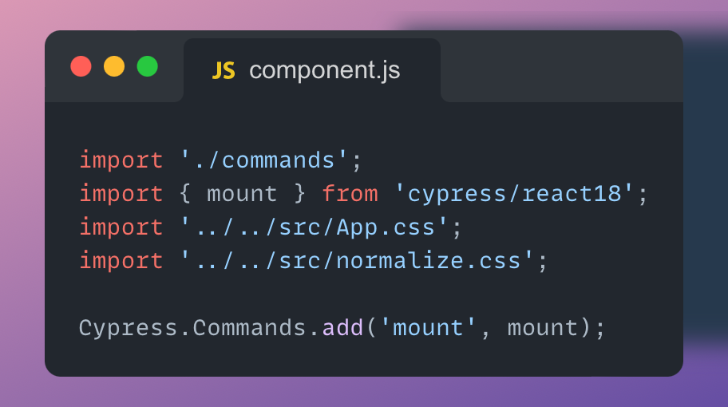

Once we save the file, our Cyress component test automatically runs with CSS loaded

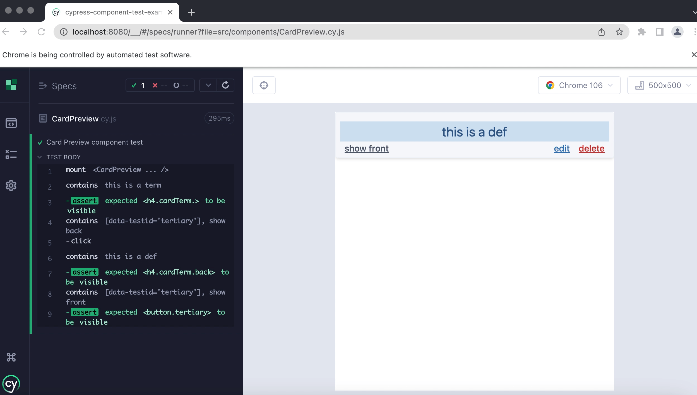

